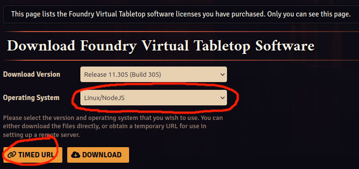

[](https://github.com/pgschk/foundryvtt-containerized/actions/workflows/docker-publish.yml)
[](https://github.com/pgschk/foundryvtt-containerized/actions/workflows/ghcr-publish.yml)

# FoundryVTT Container

This project is not affiliated with [FoundryVTT](foundryvtt.com) and is a pure containerization project that provides a container capable of running [FoundryVTT](foundryvtt.com), but **it does not contain FoundryVTT!**

In order to start this container for the first time, you need to provide a timed download URL provided through your [FoundryVTT](foundryvtt.com) account. Visit https://foundryvtt.com/purchase/ to purchase a license key for this excellent software.


## What does it do?

This container provides the necessary [nodejs](nodejs.com) environment for FoundryVTT. You will need to provide a valid timed download URL for FoundryVTT through the environment variable
`FOUNDRYVTT_DOWNLOAD_URL` as described in the examples when you first start the container. This will cause it to download FoundryVTT from that URL and store it. On subsequent launches you can remove this environment variable, or leave it, it does not cause problems.

## Obtaining the TIMED DOWNLOAD URL

1. Make sure you have purchased a valid FoundryVTT license at https://foundryvtt.com/purchase/.
2. Log into your FoundryVTT.com account.
3. Visit https://foundryvtt.com/me/licenses.
4. On this page, set "Operating System" to "Linux/NodeJS"
5. Click the "TIMED URL" button. This copies a timed download URL to your clipoard.
6. Paste this URL as environment variable `FOUNDRYVTT_DOWNLOAD_URL` and start your container (see examples below)



## Examples

### Docker

```
docker run -p 8080:8080 -v ./data:/data/foundry -v ./install:/usr/src/app/foundryvtt -e FOUNDRYVTT_DOWNLOAD_URL="<your-timed-download-url>" pgschk/foundryvtt-containerized:latest
```

Visit http://localhost:8080/ to confirm the FoundryVTT Terms of Service and enter your license key.

### Docker Compose

Go to [examples/docker-compose](./examples/docker-compose/) and edit `.env` to set your timed download URL for FoundryVTT.

Afterwards run
```
docker compose up -d
```

Visit http://localhost:8080/ to confirm the FoundryVTT Terms of Service and enter your license key.


### Kubernetes

- Review and adapt the example in [examples/kubernetes/deployment.yaml](./examples/kubernetes/deployment.yaml).
- Make sure to set your timed download URL for FoundryVTT as enviroment variable `FOUNDRYVTT_DOWNLOAD_URL`.
- Start your Kubernetes deployment:

```
kubectl apply -n <target namespace> -f examples/kubernetes/deployment.yaml
```